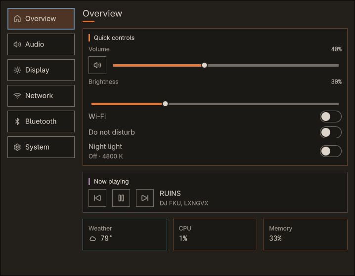

# Mitishell

Mitishell (MY-ti-shell) is a personal Hyprland desktop shell built with QuickShell. It uses the Cinder Grove visual language and targets Arch Linux.



It provides a configurable bar, launcher, quick settings, notifications, power controls, clipboard history, reminders, weather, and focused overlays for common desktop tasks. Optional integrations stay out of the way when their supporting tools are unavailable.

User installation, configuration, feature guides, and optional dependency details live in the [Mitishell wiki](https://github.com/aileks/mitishell/wiki).

## Build requirements

- Hyprland
- hyprshutdown
- QuickShell 0.3.0
- Go 1.26 or newer
- Qt 6 QML tooling
- Node.js
- GNU Make
- A Nerd Font for shell and OSD glyphs

## Build from source

```bash
git clone https://github.com/aileks/mitishell.git
cd mitishell
make build
make run
```

`make run` builds the Go CLI and starts the shell directly from the checkout. It sets the paths needed for the development binary and QuickShell source tree.

To install the current checkout for your user:

```bash
make install
quickshell -n -p ~/.local/share/mitishell/shell
```

## Development

Set `MITISHELL_QS_PATH` to the repository's `shell` directory when using CLI commands that talk to a development instance outside `make run`.

```bash
make test   # Go, race, JavaScript, and QML tests
make check  # tests, formatting, vet, QML linting, and whitespace checks
```

## License

Mitishell is licensed under the GPLv3 or later. See [LICENSE](LICENSE).

The prebuilt binary includes third-party software. See [THIRD_PARTY_LICENSES.md](THIRD_PARTY_LICENSES.md).
